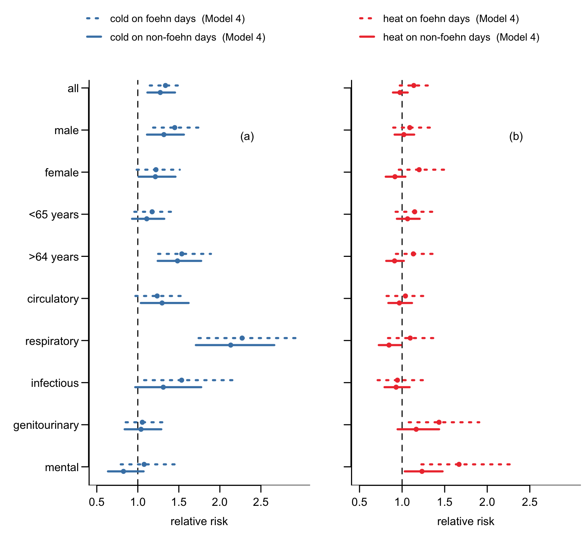

# *The risk of hospitalization associated with foehn winds and heat in the mountainous region of Switzerland*

authors: Tino Schneidewind [1,2], Sujung Lee [1,2], Ana Maria Vicedo-Cabrera [1,2], Apolline Saucy [1,2]

1 Institute for Social and Preventive Medicine, University of Bern, Switzerland

2 Oeschger Centre for Climate Change Research, University of Bern, Switzerland

 

**Abstract**

**Background**: Foehn winds are intense warm winds, common in mountain regions, but their health impacts and potential to exacerbate existing heat-related risks remain poorly understood. This is particularly concerning for rural areas where older, heat-vulnerable individuals live.

**Objective:** We investigated the independent and combined association of foehn winds and temperature with cause-specific emergency hospitalizations in Switzerland.

**Methods**: We analyzed daily temperature, foehn winds intensity and cause-specific hospitalizations near 8 foehn wind-observing meteorological stations in Switzerland (1998-2019). We performed a case-time series analysis to examine the association between foehn winds intensity and hospitalization risk with and without temperature adjustment, and whether foehn winds amplify heat and cold-related hospitalizations with an interaction term between foehn winds and temperature.

**Results**: Foehn winds intensity showed small and no consistent association with hospitalizations in temperature-adjusted (0.4% (95% CI: -1.1%; 1.8%) per 6 hours increase in daily full foehn winds intensity) and non-adjusted models (0.8% (-0.5%; 2.3%)). However, foehn winds may amplify heat-related hospitalization risk with a 14% (-3%; 33%) increase in risk at the 99th temperature percentile (vs. temperature of minimum risk) on foehn days, compared to -2% (-8%; 6%) on non-foehn days. The association was larger for females, older adults, and for hospitalizations due to respiratory and mental health causes.

**Conclusion**: While foehn winds did not directly impact hospitalizations, they may contribute to an amplification of heat-related health risks, especially for females and older adults. Further research is needed to assess their effects in other regions, climates, and vulnerable populations. 

  

*(left) Cumulative relative risk (Model 4) for subpopulations at -8.9°C (1st percentile) with 95% confidence intervals and (right) cumulative relative risk (Model 4) for subpopulations at 24.7°C (99th percentile) with 95% confidence intervals.*

 

This `repository` presents the workflow and the analysis of the paper, which developed out of my master thesis. Due to the sensitivity of the hospitalization data, I cannot publish the full data of the analysis. The data that is not part of this repository but can be applied for using the following procedure. The hospitalization data was provided by the [Swiss Federal Office for Statistics](https://www.bfs.admin.ch/bfs/de/home.html) and the data can be accessed as described on their [webpage](https://www.bfs.admin.ch/bfs/de/home/statistiken/gesundheit/erhebungen/ms.html).

The non-sensitive meteorological data was provided by the [Swiss Federal Office for Meteorology and Climatology](https://www.meteoschweiz.admin.ch/#tab=forecast-map) and is part of this repository.

 

## Folders

### The analysis folder

The `analysis` folder contains the crossbasis definition methods for both foehn winds and temperature exposure (A01, A02), the procedure by which the descriptive statistics were calculated (B01, B02) and both research questions were answered (C01, C02).

### The data folder

The `data` folder includes all the environmental data in both raw and processed form, as well as the necessary shapefiles for the buffer size calculation and subsequent Medstat region selection.

### The functions folder

The `functions` folder contains R functions, which are stored there so that they can be accessed
in other R scripts.

### The output folder

The `output` folder has both all figures and tables of the paper that were created in the analysis. 

### The vignettes folder

The `vignettes` folder presents how the buffersize influences the Medstat selection (01) and an explorative investigation into the foehn wind data (02), the hospitalization data (03) and for both Altdorf (04) and Lugano (05) an overview over the processed hospitalization-foehnwind-temperature data set.
