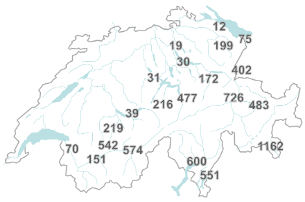

```{r setup, include=FALSE}
knitr::opts_chunk$set(echo = TRUE)

# libraries
library(sf);library(ggplot2);library(knitr);library(here)

```

### Aim of the document

Here I visualize the dependence between the selection of the Medstat regions on the buffer size. For my analysis I will include the stations in Davos, Chur, Altdorf, Montana, Visp, Magadino, Lugano, Poschiavo. The basis of the station selection was a climatological average of more than 400 hours of foehn wind annually. 

The buffer should be as small as possible, because foehn winds can appear very localized. With a buffer that is too large, our signal from foehn winds is diluted from areas that are not affected by foehn winds. If our area is too small, it is possible that we do not have enough hospitalization data to observe a significant trend, therefore lacking statistical power. The selection process here use a simple intersect between shapefiles and not the population density weighed centroids of every Medstat.

This is visible in the figure below in south western Switzerland, as Sion (151 h) and Sierre (542 h) experience very different average foehn wind hours even though they are very close to each other and part of the same valley.


```{r, echo=FALSE, warning=FALSE, out.width="80%"}





```

To visualize the effect of different buffer sizes I will loop through them and visualize the Medstat regions that were selected.

```{r load data, error=FALSE, warning=FALSE, message=FALSE}
# load data
mesh <- st_read(here("data_nonsensitive", "Medstat_shapefiles", "raw", "MEDSTAT_AREAS_2019.shp"), quiet = TRUE)

# transform meshdat geometry to MeteoSchweiz geometry
mesh$geometry <- st_transform(mesh$geometry, crs= 2056)

# create data frame with Station coordinates (from MeteoSchweiz website)
# manually searched for in mesh data set 
df_stations <- data.frame(
  station = c("Davos", "Chur", "Altdorf", "Montana", "Visp", "Magadino", "Lugano", "Poschiavo"),
  x = c("2783519", "2759489", "2690181", "2601709", "2631151", "2715480", "2717874", "2801994"),
  y = c("1187459", "1193182", "1193564", "1127489", "1128024", "1113161", "1095883", "1136249"),
  MDSTID = c("GR06200", "GR06001", "UR03002", "VS09802", "VS09605", "TI08001", "TI08204", "GR06804"))


```


```{r different_buffers, echo=FALSE}

buffer_size_list = c(30000, 20000, 10000, 8000, 5000, 2500, 1000)
buffer_list = list()

for(i in buffer_size_list){
# buffer size 10k
buffer_size <- i

# list of Meshdat regions that are set to FALSE -> TRUE when they intersect with a buffer 
df_regions <- data.frame(MDST04= mesh$MDST04, Index = rep(0, length(mesh$MDSTID)))

# calculate the buffer around the 8 stations
for (i in 1:8) {                    
  
 # change format of station coordinates into sf as a point 
 point_sf <- st_as_sf(df_stations[i,2:3], coords = c("x", "y"), crs = 2056)

 # Create the buffer
 buffer <- st_buffer(point_sf, dist = buffer_size)
 # save buffer
 buffer_list[[i]] = buffer

 # Find regions that intersect with the buffer
 intersects_with_buffer <- st_intersects(mesh$geometry, buffer, sparse = FALSE)

 # Add selected regions to regions list 
 df_regions$Index <- df_regions$Index +  intersects_with_buffer 
  
}


# Extract all regions that intersect in a list
df_regions$ID <- rep(NA, nrow(mesh))

# for every area that at least intersects once
for(i in 1:length(df_regions$MDST04)){
  if(df_regions$Index[i] > 0){
    
    # save the area code once again, all others NA
    df_regions$ID[i] <- df_regions$MDST04[i]

  }
}


# create a list for Sujung
list_regions <- na.omit(df_regions$ID)
# write.csv(list_regions, file = paste0("C:/Users/tinos/Documents/Master - Climate Science/3 - Master Thesis/data/MetStatRegions/MDSTID_MetRegions_", buffer_size, ".csv"))


# plot the selected regions
index_stations = match(df_stations$MDSTID, mesh$MDSTID)
index_regions = match(list_regions, mesh$MDST04)


map_plot <- ggplot() +
  geom_sf(data = mesh$geometry, fill = "grey", alpha = 0.5) +  # Adjust color and transparency
  geom_sf(data = mesh$geometry[index_regions], fill = "skyblue1", alpha = 0.7) +   # Adjust color and transparency
  #geom_sf(data = mesh$geometry[index_stations], fill = "brown1", alpha = 0.5) +
  geom_sf(data = buffer_list[[1]], fill = "brown1", alpha = 0.4) + 
  geom_sf(data = buffer_list[[2]], fill = "brown1", alpha = 0.4) +
  geom_sf(data = buffer_list[[3]], fill = "brown1", alpha = 0.4) + 
  geom_sf(data = buffer_list[[4]], fill = "brown1", alpha = 0.4) + 
  geom_sf(data = buffer_list[[5]], fill = "brown1", alpha = 0.4) + 
  geom_sf(data = buffer_list[[6]], fill = "brown1", alpha = 0.4) + 
  geom_sf(data = buffer_list[[7]], fill = "brown1", alpha = 0.4) + 
  geom_sf(data = buffer_list[[8]], fill = "brown1", alpha = 0.4) + 
  theme_minimal() +
  labs(title = paste0("selected regions with buffer: ", buffer_size))

print(map_plot)
}
```

The larger the buffer, the more Medstats are selected for each buffer. To achieve the balance between avoiding exposure missclassification and statistical power of the hospitalization data we have to select an appropriate radius. Buffer radii below 5km could be expected to have little statistical power as they include very few regions. However, already at 10 km buffer radius, we have overlapping buffers and Medstat regions being included that are in a neighbouring valley, possibly introducing exposure missclassification. This can be seen in the following map.

```{r tester, echo=FALSE}
buffer_size_list = c(10000)
buffer_list = list()

for(i in buffer_size_list){
# buffer size 10k
buffer_size <- i

# list of Meshdat regions that are set to FALSE -> TRUE when they intersect with a buffer 
df_regions <- data.frame(MDST04= mesh$MDST04, Index = rep(0, length(mesh$MDSTID)))

# calculate the buffer around the 8 stations
for (i in 1:8) {                    
  
 # change format of station coordinates into sf as a point 
 point_sf <- st_as_sf(df_stations[i,2:3], coords = c("x", "y"), crs = 2056)

 # Create the buffer
 buffer <- st_buffer(point_sf, dist = buffer_size)
 # save buffer
buffer_list[[i]] = buffer

 # Find regions that intersect with the buffer
 intersects_with_buffer <- st_intersects(mesh$geometry, buffer, sparse = FALSE)

 # Add selected regions to regions list 
 df_regions$Index <- df_regions$Index +  intersects_with_buffer 
  
}


# Extract all regions that intersect in a list
df_regions$ID <- rep(NA, nrow(mesh))

# for every area that at least intersects once
for(i in 1:length(df_regions$MDST04)){
  if(df_regions$Index[i] > 0){
    
    # save the area code once again, all others NA
    df_regions$ID[i] <- df_regions$MDST04[i]

  }
}


# create a list for Sujung
list_regions <- na.omit(df_regions$ID)


# plot the selected regions
index_stations = match(df_stations$MDSTID, mesh$MDSTID)
index_regions = match(list_regions, mesh$MDST04)


map_plot <- ggplot() +
  geom_sf(data = mesh$geometry, fill = "grey", alpha = 0.5) +  # Adjust color and transparency
  geom_sf(data = mesh$geometry[index_regions], fill = "skyblue1", alpha = 0.7) +  
  geom_sf(data = mesh$geometry[mesh$MDST04 == "TI22"], fill = "red", alpha = 0.7) +
  geom_sf(data = mesh$geometry[mesh$MDST04 == "TI27" ], fill = "red", alpha = 0.7) +
  geom_sf(data = mesh$geometry[mesh$MDST04 == "GR22" ], fill = "red", alpha = 0.7) +
  geom_sf(data = mesh$geometry[mesh$MDST04 == "GR10" ], fill = "red", alpha = 0.7) +
  geom_sf(data = mesh$geometry[mesh$MDST04 == "GR13" ], fill = "red", alpha = 0.7) +
  geom_sf(data = mesh$geometry[mesh$MDST04 == "GR07" ], fill = "red", alpha = 0.7) +
  geom_sf(data = mesh$geometry[mesh$MDST04 == "VS05" ], fill = "red", alpha = 0.7) +
  geom_sf(data = mesh$geometry[mesh$MDST04 == "TI01" ], fill = "red", alpha = 0.7) +
    geom_sf(data = buffer_list[[1]], fill = "brown1", alpha = 0.4) +
  geom_sf(data = buffer_list[[2]], fill = "brown1", alpha = 0.4) +
  geom_sf(data = buffer_list[[3]], fill = "brown1", alpha = 0.4) +
  geom_sf(data = buffer_list[[4]], fill = "brown1", alpha = 0.4) +
  geom_sf(data = buffer_list[[5]], fill = "brown1", alpha = 0.4) +
  geom_sf(data = buffer_list[[6]], fill = "brown1", alpha = 0.4) +
  geom_sf(data = buffer_list[[7]], fill = "brown1", alpha = 0.4) +
  geom_sf(data = buffer_list[[8]], fill = "brown1", alpha = 0.4) +
  theme_minimal() +
  labs(title = paste0("selected regions with buffer: ", buffer_size))

print(map_plot)
}

```


### Conclusion

This process has to be repeated with population density weighed centroids of the Medstat regions, however, we see that an buffer radius approximately between 5km and 10km is best suited.

<br>
